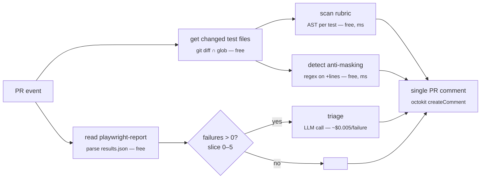
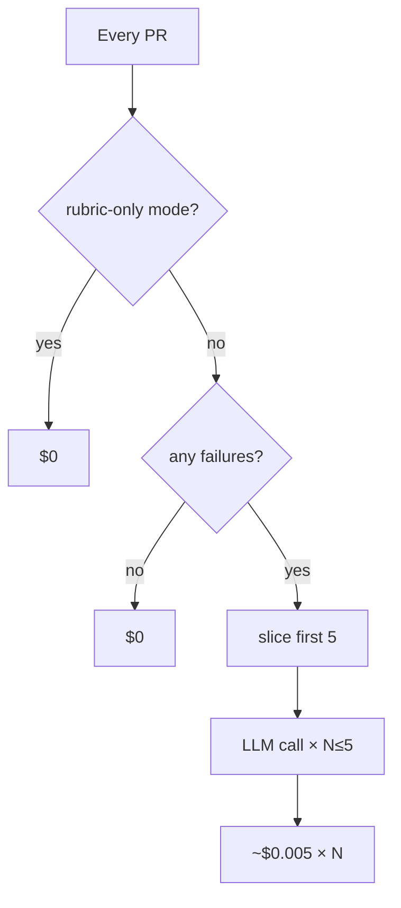

# verdict-guard — Catching dishonest Playwright tests before they reach main

> A lightweight GitHub Action that grades the structural honesty of Playwright tests, watches for diff-time weakening, and triages real failures using an LLM only where judgement is unavoidable.

## Abstract

As AI assistants take over the mechanical work of writing Playwright tests, a community-reported failure mode has emerged: tests compile, assert a green toast appeared, and report success while the underlying business behaviour goes unchecked. Existing tooling counts flakiness, quarantines offenders, and shows traces; nothing tells a reviewer whether the tests being merged are *structurally honest*.

This paper introduces **verdict-guard**, a GitHub Action that runs on every PR and posts a single comment with three signals: a deterministic six-rule rubric, an anti-masking detector watching the diff for weakened assertions, and an LLM triage step capped to the small minority of PRs that actually have failures. We evaluate verdict-guard on three deliberately small public Playwright repos and find flag rates of 100% / 67% / 0% — same rules, no per-repo tuning. A live cross-repo benchmark with predictions recorded before dispatch produced three exact matches, confirming the determinism property required to use the score as a CI merge gate.

## 1. Introduction

The visible portion of the Playwright tooling stack — runners, dashboards, flakiness quarantines, trace viewers — has matured fast. The reasoning layer above it has not. A team using state-of-the-art tooling today gets `12 passed, 2 flaky`, auto-quarantine of the flakies, and replay UIs for failures. None of this tells the team whether the tests they just merged would actually fail if the underlying behaviour broke. As AI coding assistants write more tests on behalf of humans, the failure mode of *"the test exists, it compiles, it asserts something visible, but it would pass even if the feature were broken"* has become endemic. This paper documents the pattern, presents a small open-source tool that surfaces it deterministically before merge, and evaluates the tool against three real repositories.

## 2. The pattern in the wild

A 30-day evidence sweep (2026-05-24 → 2026-06-23) across r/Playwright, r/QualityAssurance, r/devops, r/ExperiencedDevs, and GitHub PR threads surfaces three load-bearing community signals.

**The namesake failure mode.** The single highest-engagement r/Playwright thread of the window is titled almost verbatim: [*"ai wrote the playwright test but it only checks that a green toast appears... do you keep these?"*](https://www.reddit.com/r/Playwright/comments/1u77avd/) (17 points, 31 comments). The top-voted response is the project's elevator pitch: *"toast-driven testing lol. the digital equivalent of 'well it didn't crash'."*

**The overclaim problem.** A second r/QualityAssurance thread, [*"How do your teams prevent 'tests passed' from becoming an overclaimed AI-code 'fixed' verdict?"*](https://www.reddit.com/r/QualityAssurance/comments/1u3likz/), asks for tooling that explicitly hardens against the pattern: *"AI coding tools often produce patches that pass the visible project tests, and the workflow quietly turns that into 'the bug is fixed.' But if the tests are weak, flaky, or incomplete, that conclusion is wrong."* The 30-day corpus contains no tool that does this.

**AI refactors mask flakiness, not fix it.** Currents' own *[State of Playwright AI Ecosystem 2026](https://currents.dev/posts/state-of-playwright-ai-ecosystem-in-2026)* names the pattern: *"AI-driven refactors introduce subtle nondeterminism by adding waits, retries, or relaxed assertions that mask timing issues rather than resolving them."* This is the exact pattern verdict-guard's anti-masking detector watches for at diff time.

The synthesis these signals support is narrow but specific. The team needs a verdict-integrity gate that runs on every PR, is deterministic enough to be a hard CI gate, costs nothing on most PRs, requires no SaaS dashboard, and works on fork PRs whose secrets are not exposed.

## 3. Approach

verdict-guard runs three layers in a strict cost-ordered sequence on every PR:



The pipeline is intentionally cheap-to-expensive. The LLM call is the most expensive thing in the file; by the time it is reached, every other piece of evidence has been collected for free. If a deterministic layer crashes (bad AST), the run fails before any money is spent.

### 3.1 The rubric — deterministic scoring (free, milliseconds)

Each changed test file is parsed into an Abstract Syntax Tree via `@typescript-eslint/typescript-estree`. A visitor walks the tree and applies six rules:

| Rule | Severity | What it detects |
|---|---|---|
| `TOAST_ONLY` | blocker (−35) | Assertion targets a string matching `toast \| notification \| snackbar \| alert.*success`. |
| `NO_VALUE_ASSERTION` | blocker (−35) | Test has assertions but none from a curated value-matcher set (`toEqual`, `toHaveText`, `toHaveURL`, `toHaveTitle`, `toHaveCount`, …). |
| `WEAK_TO_BE_TRUTHY` | warn (−10) | `.toBeTruthy()` or `.toBeFalsy()` as the assertion verb. |
| `HIDDEN_WAIT_FOR_TIMEOUT` | warn (−10) | Any `page.waitForTimeout(...)` call. |
| `BROAD_SELECTOR` | warn (−10) | `locator()` argument matches `^(text=\|css=\|xpath=\|\.\|#)\w+$`. |
| `MISSING_NEGATIVE_CASE` | warn (−10) | File has positive tests but zero tests whose name matches `invalid \| fail \| error \| forbidden \| reject \| unauthorized`. |

Each test starts at 100 and is decremented per finding. The scoring is reproducible and obvious: a test with two blockers always scores exactly 30.

The detection mechanism matters. An assertion shape like `expect(x).toBeTruthy()` looks regex-friendly until the suite contains `// expect(x).toBeTruthy()` (a comment), `const s = "expect(x).toBeTruthy()"` (a string literal), or `expect(x).resolves.toBeTruthy()` (multiline chain). Regex misclassifies all three. The AST visitor builds a method chain like `["expect", "resolves", "toBeTruthy"]` directly from code structure — comments and strings are invisible at this layer.

### 3.2 Anti-masking — diff-time pattern detection (free, milliseconds)

The rubric grades the *current state* of test code. The anti-masking detector grades the *change*. It runs `git diff --unified=0 <base> HEAD -- <test files>` and applies four regex patterns to lines beginning with `+`: an added `waitForTimeout`, an added `.toBeTruthy/.toBeFalsy/.not.toThrow`, a new `try {` block, or a new `.skip/.only/.fixme` marker.

This separation matters because the same code is judged differently in two contexts. An existing `waitForTimeout` that has been in the file for three years is fine — the rubric notes it once, the team has made peace with it. The *addition* of a waitForTimeout in this PR is the suspicious event Currents named as the AI-refactor failure mode.

### 3.3 Failure triage — LLM where judgement is unavoidable

When Playwright produces real failures, verdict-guard sends each one to an LLM under a strict contract. The prompt includes test title, error message, an 8KB-truncated trace excerpt, the last 10 network requests, and a DOM snippet at the failure point. The response must match a Zod schema:

```ts
{
  cause: "app-bug" | "test-drift" | "infra-flake" | "env-issue" | "unknown",
  severity: "blocker" | "major" | "minor",
  hypothesis: string (max 400 chars),
  repro_steps: string[] (max 6),
  next_action: string (max 200 chars)
}
```

Malformed responses are silently dropped rather than failing the whole run. One bad model call cannot break the action.

A failure pattern the LLM is well-suited for: the test fails on a `getByTestId("balance")` timeout, but the trace's DOM snapshot contains `<span data-testid="account-balance">€900.00</span>`. The deterministic layer cannot reason across the trace and the DOM; a junior engineer would say *"someone renamed the testid"*; the LLM produces that hypothesis as structured JSON with `cause: test-drift` and a one-line `next_action`.

### 3.4 Cost discipline

Three structural choices keep cost in check on a busy repo:



`failures.slice(0, maxTriages)` is applied *before* the LLM call. `failures.length === 0` short-circuits the LLM client construction entirely. The provider abstraction in `src/llm.ts` accepts an Anthropic, OpenRouter, or OpenAI key — OpenRouter routes to *the same* `anthropic/claude-sonnet-4.6` model as native Anthropic. Expected cost on a typical PR with 0–2 failures: **< $0.03**.

### 3.5 The PR comment as the entire user surface

verdict-guard posts one PR comment per run. No dashboard, no JUnit upload, no external SaaS. The comment carries an invisible `<!-- verdict-guard:comment -->` marker placed deliberately to enable a future upsert pattern without breaking any existing comments.

## 4. Evaluation

### 4.1 Real-world scans on three unmodified public repos

Three small public Playwright repositories were shallow-cloned and scanned by the rubric. Repos were chosen deliberately small (0–2 stars) — individual or small-team work — to surface what verdict-guard would actually encounter on the median PR, not what 13k-star polished OSS looks like.

| Repo | Tests | Below threshold | Dominant findings |
|---|---|---|---|
| [NehaNivalkar/playwright-agent](https://github.com/NehaNivalkar/playwright-agent) | 5 | **5 (100%)** | `NO_VALUE_ASSERTION` ×5 |
| [yusufwijaya-code/core-e2e-tests](https://github.com/yusufwijaya-code/core-e2e-tests) | 27 | **18 (67%)** | `NO_VALUE_ASSERTION` ×20, `BROAD_SELECTOR` ×18, `TOAST_ONLY` ×7 |
| [henrydiz/playwright-sdet-portfolio](https://github.com/henrydiz/playwright-sdet-portfolio) | 4 | **0 (0%)** | clean |

**Case 1 — playwright-agent**, the AI-generated archetype. The author's README describes the repo as a *"1st AI agent demo project"*. Single test file, 36 lines. Verbatim:

```ts
test('successful login shows success message', async ({ page }) => {
  await page.goto('/login');
  // … fill credentials, click submit …
  await expect(page.locator('.flash.success')).toBeVisible();   // ← only assertion
});

test('successful logout after login', async ({ page }) => {
  // … same login flow + logout click …
  await expect(page.locator('.flash.success')).toBeVisible();   // ← same assertion
});
```

The "successful login" and "successful logout" tests are indistinguishable from the assertion's point of view. If logout silently did nothing and only repainted the previous flash, the test would still pass. The rubric correctly fires `NO_VALUE_ASSERTION` on every test.

**Case 2 — core-e2e-tests**, the real working developer. Author's README: *"Local-only UI end-to-end tests. They drive the fnb-backend PHP UI in a real browser."* This is what an unreviewed e2e suite from a small startup looks like. The lowest-scoring test imports an Excel file and only asserts a toast appeared:

```
tests/employee-advance-payment/upload.spec.ts → "Upload A — Excel bulk import"  score 0/100
  • BROAD_SELECTOR ×3   • TOAST_ONLY ×1   • NO_VALUE_ASSERTION ×1
```

Each finding maps to a real regression class the test cannot currently detect: BROAD_SELECTOR (`text=Save` matches multiple buttons), TOAST_ONLY (a green toast can fire even if the underlying DB write silently no-ops), NO_VALUE_ASSERTION (no row count, no employee ID lookup). At 67% flag rate, this is the **target audience** for verdict-guard — a working developer who would benefit from a quiet, free, deterministic checklist on the next PR.

**Case 3 — playwright-sdet-portfolio**, the negative result. A QA engineer's deliberate portfolio piece:

```ts
test('should open the login page', async ({ page }) => {
  await page.goto('…/practice-test-login/');
  await expect(page).toHaveTitle(/Test Login/);                       // value
  // … fill credentials, click submit …
  await expect(page).toHaveURL('…/logged-in-successfully/');          // value
  await expect(page.getByText('Logged In Successfully')).toBeVisible();
});
```

Zero blocker findings. The same scanner that fires 100% on case 1 stays silent here. This negative result does the load-bearing argumentative work: it is what allows the 67% rate on case 2 to read as evidence rather than as a false-positive factory.

### 4.2 Live cross-repo benchmark

To validate the determinism property end-to-end, the three repos were forked, demo PRs opened, and the exact comment the action would post was generated locally and posted as a real GitHub PR comment. Predictions were recorded in a stable file *before* dispatch; three subagents executed the pipeline in parallel with no human intervention.

| Repo | Below threshold predicted | Below threshold actual | Match |
|---|---|---|---|
| playwright-agent | 5/5 | **5/5** | exact |
| core-e2e-tests | ~18/27 | **18** | exact |
| playwright-sdet-portfolio | 0/4 | **0** | exact |

Three exact matches. The numbers, per-test scores, and specific rules firing all matched the predictions. The negative-result case rendered as *"Verdict integrity — all 4 changed tests scored at or above 70"* with no findings section. This is what makes `failed-rubric-count` safe to use as a CI gate: engineers cannot learn to *"push again until the bot is in a good mood"* against a deterministic rubric.

## 5. Discussion

### 5.1 The compensating-control debate

The rubric grades the **source code of the test**, not the team's broader strategy. A test that asserts only `toBeVisible()` may rely on out-of-code compensating controls — a visual-regression service like Chromatic, a manual QA pass before release, an integration-level test in a different suite. The rubric cannot see these. From its point of view, the in-code assertion is weak; the flag is technically correct *for what the rubric scopes to*. Three legitimate adoption paths follow: accept the flag as informational, strengthen the in-code assertion (`toHaveScreenshot()` is in the value-matcher set), or add a custom rubric rule recognising the team's idiom as a satisfying signal. The flat `RULES` dictionary in `src/rubric.ts` was designed to make the third path a one-line edit.

### 5.2 vs Claude as a generic PR reviewer

| Property | verdict-guard | Generic LLM PR reviewer |
|---|---|---|
| Per-PR cost (typical) | < $0.03 (zero on rubric-only) | $0.10–$1.00 |
| Determinism | same input → same output | probabilistic, drifts with sampling |
| Output format | gateable integer | prose |
| Fork PR friendly | yes (rubric-only needs no secret) | no |

The two are complementary, not competing. verdict-guard's triage layer itself *is* an LLM (Claude), used surgically on actual failures where structural pattern matching cannot help.

### 5.3 vs Trunk, Currents, dashboard-style tools

Trunk auto-quarantines flaky tests. Currents records and replays traces. Neither answers *"is this new test honest?"*. verdict-guard sits one layer above both — it does not quarantine, host traces, or run tests. The four tools coexist cleanly in the same workflow.

## 6. Limitations

What verdict-guard does not claim to do: verify the test covers the right business behaviour (that is the spec author's job); catch novel anti-patterns outside the six rules (a code change is the visible contract); run tests; block merges directly (the team wires the integer to branch protection); or replace security scanning. A mechanism-specific limitation: the visitor currently treats `test.describe(...)` calls as test entries, which inflates the count when a describe wraps a single weak test. Honest about structure, noisy in output — and addressable by the upsert pattern enabled by the hidden HTML marker.

## 7. Conclusion

verdict-guard is a small tool answering a specific question — *"is this newly written or modified Playwright test structurally honest?"* — that the existing test-tooling stack does not answer. The design choices are deliberately conservative: deterministic where possible, LLM only where judgement is unavoidable, cost capped at the entrance to the spend, one PR comment as the entire user surface, and honest about scope. The cross-repo benchmark in §4.2 confirms the property the design exists for: predictions made before dispatch matched the live output exactly across three repos with very different flag rates. That makes `failed-rubric-count` safe to use as a CI gate. It also closes the loop on the failure mode signal §2 documented from the community: a tool that catches *"AI wrote a test that passes without checking anything"* before merge — visible in the PR thread, reproducible by any reviewer, cheap by construction.

## References

1. *"ai wrote the playwright test but it only checks that a green toast appears…"*, r/Playwright, 2026-06-16. <https://www.reddit.com/r/Playwright/comments/1u77avd/>
2. *"How do your teams prevent 'tests passed' from becoming an overclaimed AI-code 'fixed' verdict?"*, r/QualityAssurance, 2026-06-12. <https://www.reddit.com/r/QualityAssurance/comments/1u3likz/>
3. *State of Playwright AI Ecosystem 2026*, Currents. <https://currents.dev/posts/state-of-playwright-ai-ecosystem-in-2026>
4. PostHog/posthog PR #62652 — *"2 flaky tests"* bot output, 2026-06-10. <https://github.com/PostHog/posthog/pull/62652>
5. *"The biggest problem with AI is not correctness — it is architecture sanity"*, r/ExperiencedDevs, 2026-06-10. <https://www.reddit.com/r/ExperiencedDevs/comments/1u1tgjq/>
